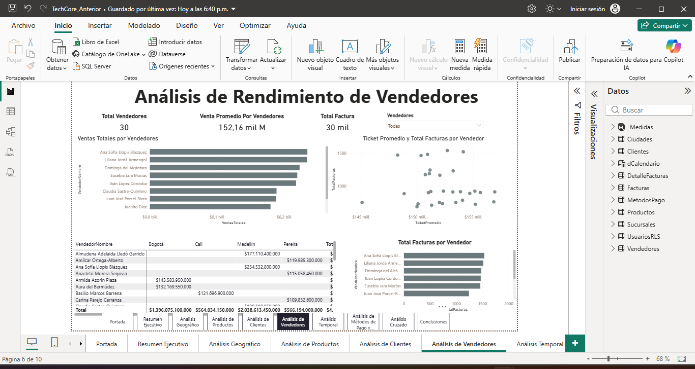
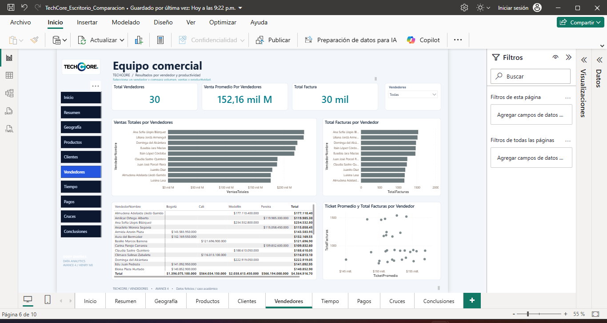
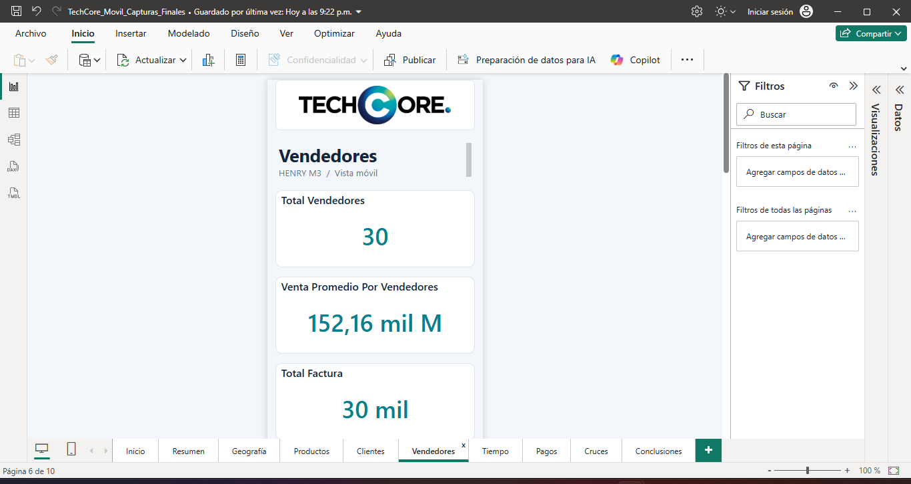

<p align="center"></p>

# TechCore · Análisis de ventas en Power BI

Proyecto académico de Business Intelligence que recorre la limpieza de ventas, el modelado relacional y la construcción de informes para escritorio y móvil. La entrega actual es el **Avance 4**, con dos plantillas independientes y diez páginas en cada versión.

Los datos se presentan como ficticios dentro del caso académico. El modelo conserva **11 tablas, 8 relaciones, 26 medidas DAX y 3 roles RLS**. El margen y el costo identificados como simulados son supuestos del caso, no costos contables observados.

## Inicio rápido

1. Descarga el repositorio completo y extráelo. Mantén sus carpetas juntas.
2. En Windows, instala Power BI Desktop.
3. Abre `scripts/iniciadores` y ejecuta uno de estos archivos:

| Vista | Iniciador | Plantilla |
| --- | --- | --- |
| Escritorio | [INICIAR_ESCRITORIO.bat](scripts/iniciadores/INICIAR_ESCRITORIO.bat) | [TechCore_Escritorio_Avance_4.pbit](dashboards/avance_04/escritorio/TechCore_Escritorio_Avance_4.pbit) |
| Móvil | [INICIAR_MOVIL.bat](scripts/iniciadores/INICIAR_MOVIL.bat) | [TechCore_Movil_Avance_4.pbit](dashboards/avance_04/movil/TechCore_Movil_Avance_4.pbit) |

En el primer inicio se ajustan las rutas de datos y se prepara la plantilla. Cuando Power BI termine de cargarla, guarda tu informe como PBIX. Los BAT tienen sus PS1 adjuntos; no requieren ejecutar como administrador. Si faltan en la caché, la preparación descarga pbi-tools Core y .NET 8 de sus fuentes oficiales.

La plantilla móvil también se puede revisar en el PC. Para verla en el teléfono, guarda el PBIX, publícalo en Power BI y ábrelo con Power BI Mobile y una cuenta con acceso. Consulta la [guía de instalación](docs/instalacion.md) y la [guía de uso](docs/uso.md).

## Páginas del informe

| Página | Análisis |
| --- | --- |
| Inicio | Presentación del proyecto y navegación |
| Resumen | Ventas, facturas, unidades y ticket promedio |
| Geografía | Ciudades y sucursales |
| Productos | Marcas, productos, participación y precio |
| Clientes | Perfil de compra y segmentos |
| Vendedores | Desempeño del equipo comercial |
| Pagos | Métodos de pago y descuentos |
| Tiempo | Evolución y comparaciones temporales |
| Cruces | Relaciones entre segmentos y resultados |
| Conclusiones | Hallazgos y recomendaciones del caso |

El logotipo original aparece en el encabezado de las diez páginas de ambas versiones. Escritorio usa navegación lateral; móvil usa una distribución vertical con indicadores de ancho completo. El [índice visual](docs/indice-visual.html) muestra esquemas de distribución, no capturas renderizadas por Power BI: descarga el HTML y ábrelo en el navegador.

## Comparación de diseño

Las [capturas reales del Avance 3 y las dos vistas del Avance 4](comparacion/README.md) documentan la evolución del diseño. Abre la [galería interactiva](comparacion/galeria.html) localmente para comparar las diez páginas. Móvil se muestra como previsualización en Power BI Desktop.

| Avance 3 · Original | Avance 4 · Escritorio |
| --- | --- |
|  |  |



Consulta el [análisis de diseño](docs/comparacion-diseno.md) para revisar los cambios entre versiones.

El [documento de presentación · TechCore: evolución del dashboard](docs/presentacion/TechCore_Evolucion_Dashboard.pdf) reúne el recorrido del proyecto y la comparación visual en ocho páginas. Las [ocho láminas individuales](docs/presentacion/README.md) también están disponibles como documentos PNG.

## Estructura

```text
TechCore_GitHub/
├── README.md
├── assets/                   # Logotipo original
├── dashboards/avance_04/     # Plantillas PBIT de escritorio y móvil
├── datos/                    # CSV y XLSX utilizados por la entrega actual
├── src/avance_04/            # Modelo de datos y definiciones PBIR editables
├── scripts/
│   ├── iniciadores/          # BAT y PS1 separados por vista
│   ├── verificacion/         # Verificador y esquemas Microsoft
│   └── Preparar_TechCore.ps1
├── comparacion/               # Capturas, galería y procedencia
├── docs/                     # Documentación actual e informes de verificación
└── historico/entrega_anterior/ # Avances 1–3 y documentación original intactos
```

Los registros y rutas del equipo se generan en `.local/`, excluida de Git. La [arquitectura](docs/arquitectura.md) explica qué archivo se edita y cómo se convierte en una plantilla.

## Documentación

- [Instalación y solución de problemas](docs/instalacion.md)
- [Uso de los dashboards y publicación móvil](docs/uso.md)
- [Arquitectura, relaciones y roles](docs/arquitectura.md)
- [Datos y diccionario de columnas](docs/datos.md)
- [Catálogo de las 26 medidas DAX](docs/medidas-dax.md)
- [Comparación de diseño y capturas](docs/comparacion-diseno.md)
- [Documento de presentación en PDF](docs/presentacion/TechCore_Evolucion_Dashboard.pdf)
- [Índice de las ocho láminas](docs/presentacion/README.md)
- [Historial de avances](docs/historial.md)
- [Validación y mantenimiento](docs/validacion.md)
- [Cómo subir este proyecto a GitHub](docs/github.md)
- [Documentación original conservada](historico/entrega_anterior/Documentacion/README.md)

## Estado de la entrega

Las plantillas se compilan y sus definiciones PBIR se verifican contra esquemas de Microsoft. Se comprueban recursos, límites del lienzo, disposición móvil, conservación del modelo y archivos históricos. Los resultados están en [docs/validacion](docs/validacion).

La apariencia se documenta mediante capturas nativas de Power BI Desktop con la instantánea de datos del informe original. La actualización de las fuentes, los mapas autenticados, los permisos RLS y la revisión en un teléfono siguen requiriendo comprobación en esas aplicaciones.

Autor del informe: **Dody Salim Dueñas Remache**. Proyecto académico Henry M3. Esta reorganización conserva la documentación y atribuciones de la entrega anterior.
