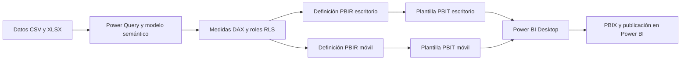

# Arquitectura

## Flujo de trabajo



`src/avance_04/Modelo/Model/database.json` contiene el modelo Raw utilizado por pbi-tools Core. `src/avance_04/PBIR_Escritorio` y `PBIR_Movil` contienen las páginas y visuales de cada vista. El informe legado dentro de `Modelo/Report` se conserva porque forma parte de la fuente del compilador; al empaquetar se sustituye `Report/Layout` por la definición PBIR de la vista elegida.

El PNG del logotipo se incorpora como un recurso estático del informe. `assets/techcore-logo.png` permite mostrarlo en GitHub; la copia incluida en `Modelo/StaticResources` permite compilar las plantillas sin depender de una URL.

## Tablas

| Tabla | Columnas | Medidas |
| --- | ---: | ---: |
| `Ciudades` | 2 | 0 |
| `Clientes` | 8 | 0 |
| `DetalleFacturas` | 6 | 0 |
| `Facturas` | 12 | 0 |
| `MetodosPago` | 2 | 0 |
| `Productos` | 4 | 0 |
| `Sucursales` | 4 | 0 |
| `Vendedores` | 2 | 0 |
| `dCalendario` | 9 | 0 |
| `_Medidas` | 0 | 26 |
| `UsuariosRLS` | 4 | 0 |

Las ocho tablas de negocio se complementan con `dCalendario`, `_Medidas` y `UsuariosRLS`. `UsuariosRLS` no tiene relaciones físicas; sus valores se consultan desde las reglas RLS.

## Relaciones reales del modelo

| Lado de detalle | Columna | Lado de referencia | Columna | Dirección de filtro configurada |
| --- | --- | --- | --- | --- |
| `Sucursales` | `CiudadID` | `Ciudades` | `CiudadID` | Predeterminada del modelo |
| `Facturas` | `ClienteID` | `Clientes` | `ClienteID` | Predeterminada del modelo |
| `DetalleFacturas` | `FacturaID` | `Facturas` | `FacturaID` | Bidireccional |
| `DetalleFacturas` | `ProductoID` | `Productos` | `ProductoID` | Predeterminada del modelo |
| `Facturas` | `SucursalID` | `Sucursales` | `SucursalID` | Predeterminada del modelo |
| `Facturas` | `VendedorID` | `Vendedores` | `VendedorID` | Predeterminada del modelo |
| `Facturas` | `MetodoPagoID` | `MetodosPago` | `MetodoPagoID` | Predeterminada del modelo |
| `Facturas` | `FechaVenta` | `dCalendario` | `Date` | Predeterminada del modelo |

La relación entre `DetalleFacturas` y `Facturas` tiene filtrado bidireccional explícito. Se conserva la configuración original; esta reorganización no modifica la lógica de filtros.

## Roles RLS

### Gerente Nacional

El modelo no define filtros de tabla para este rol.

### Gerente Regional

Regla aplicada a `Ciudades`:

```dax
[NombreCiudad] = 
LOOKUPVALUE(
    UsuariosRLS[CiudadFiltro],
    UsuariosRLS[UserEmail (UPN)], USERPRINCIPALNAME(),
    UsuariosRLS[RolAsignado], "Gerente Regional"
)
```

### Gerente Sucursal

Regla aplicada a `Sucursales`:

```dax
[SucursalNombre] = 
LOOKUPVALUE(
    UsuariosRLS[SucursalFiltro],
    UsuariosRLS[UserEmail (UPN)], USERPRINCIPALNAME(),
    UsuariosRLS[RolAsignado], "Gerente Sucursal"
)
```

Los roles y sus expresiones se conservan. Antes de compartir el informe publicado, asigna los usuarios a los roles y prueba las identidades correspondientes en Power BI. La validación de archivos comprueba la conservación de las reglas, no ejecuta una prueba de acceso en el servicio.

## Archivos locales

`.local/generado` contiene copias temporales del modelo, registros y resultados intermedios. `.local/ubicacion_<vista>.json` guarda únicamente la ubicación usada por el iniciador para detectar cambios de carpeta. Estos archivos se regeneran y no se suben a GitHub.

Referencia: [Estructura de informes PBIR en Microsoft Learn](https://learn.microsoft.com/en-us/power-bi/developer/projects/projects-report).
