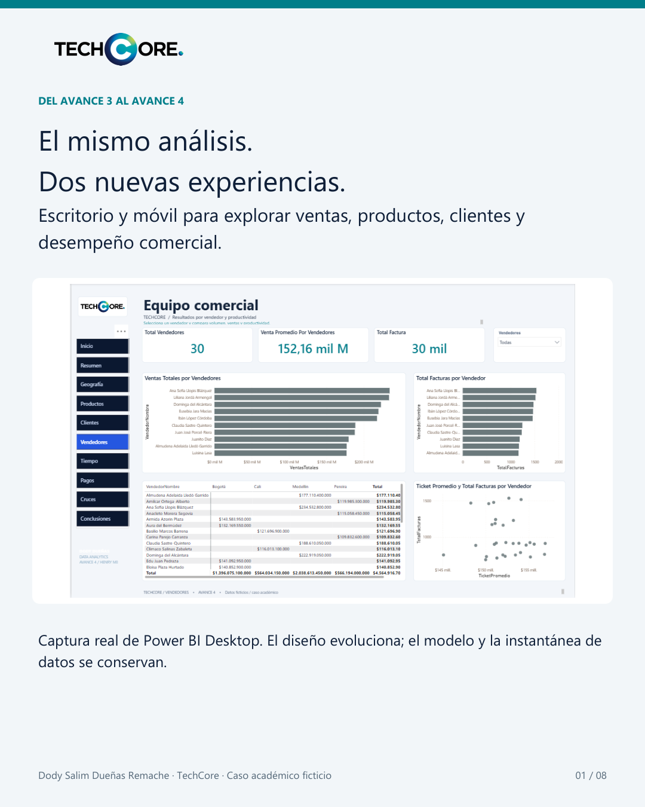

# Documentos de presentación

El [PDF TechCore · Evolución del dashboard](TechCore_Evolucion_Dashboard.pdf) y sus ocho láminas muestran el recorrido del proyecto y la comparación entre el Avance 3 y las dos vistas del Avance 4.

Las capturas proceden de Power BI Desktop; móvil corresponde a su previsualización en el PC.

## Láminas

1. [El mismo análisis · dos nuevas experiencias](laminas/01.png)
2. [Avance 3 · dashboard original](laminas/02.png)
3. [Avance 4 · escritorio](laminas/03.png)
4. [Vendedores · antes y después](laminas/04.png)
5. [Avance 4 · vista móvil](laminas/05.png)
6. [Un proyecto con continuidad](laminas/06.png)
7. [Revisión y pruebas pendientes](laminas/07.png)
8. [TechCore · portafolio de BI](laminas/08.png)

